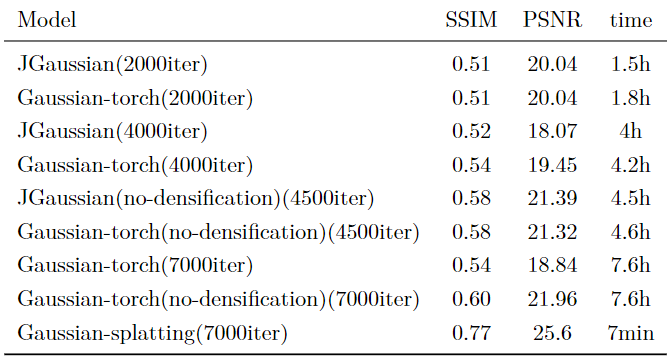

# Gaussian_torch

try to replace the CUDA part in offical implemention with pytorch 

## how to use

This project is mainly based on official implemention of Gaussian Spaltiing , the args are all similar to official implemention.To get detailed explanation of args , you can click [it](https://github.com/graphdeco-inria/gaussian-splatting) to look detailed imformation

After your training , if you want it to look in web , you can download your output folders' .ply file and drag it to [there](https://antimatter15.com/splat/) to look it in the 3D scene .

Noticed that because of CUDA memory , we all reduce the image resolution to 0.125 by using args of "-r" "8"

The rusults is like below , notice that all test is finished in TITANXP,We believe that the reason for the decline in rendering quality after adding densification is that the Guassian points are not densified but are constantly pruned due to inappropriate densification parameters. This is also the focus of the next step of parameter adjustment.

You can find that the official implementation is the best, so this project is for reference only.

## reference

1. [https://github.com/graphdeco-inria/gaussian-splatting](https://github.com/graphdeco-inria/gaussian-splatting)
2. [https://github.com/hbb1/torch-splatting](https://github.com/hbb1/torch-splatting)
3. [https://github.com/antimatter15/splat](https://github.com/antimatter15/splat)
4. [JGaussian](https://github.com/xiazhi1/JGaussian)